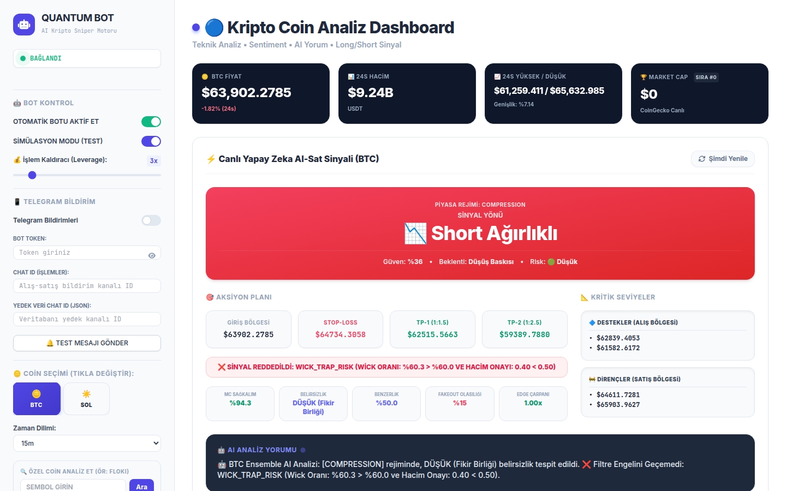
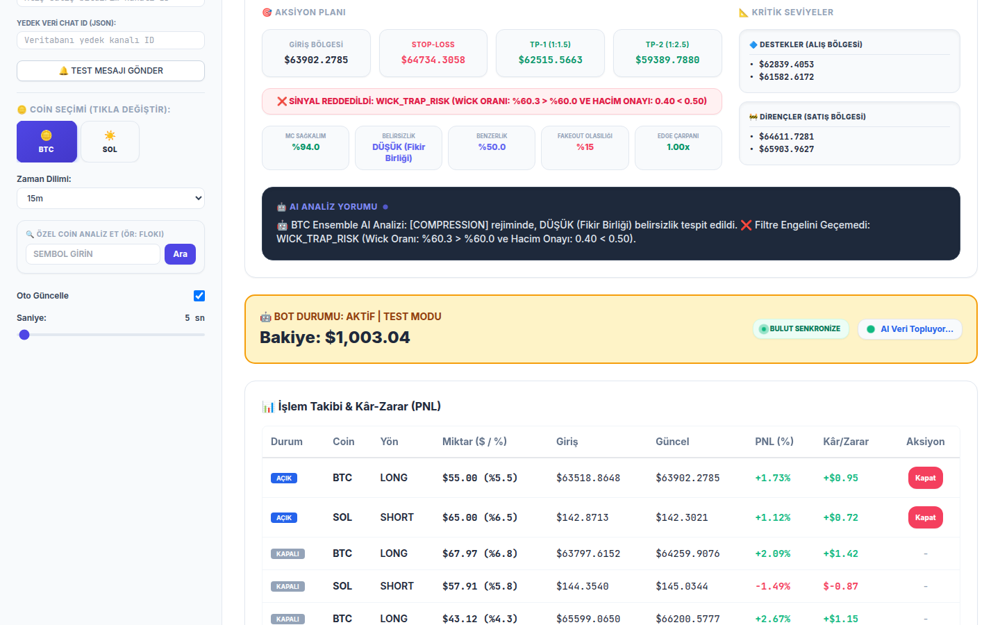
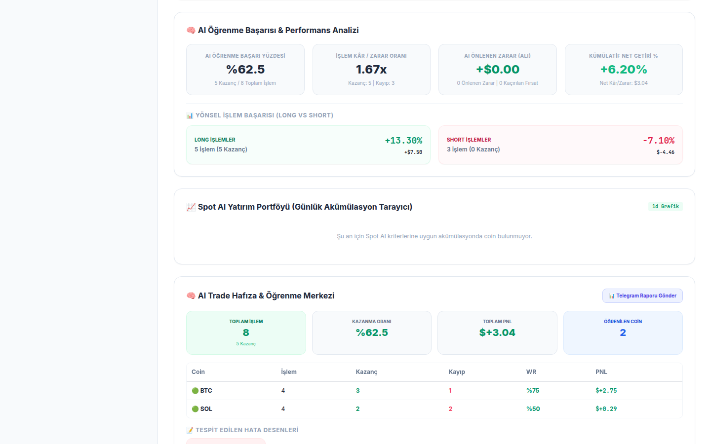
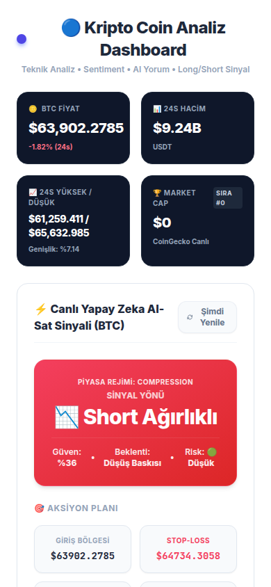
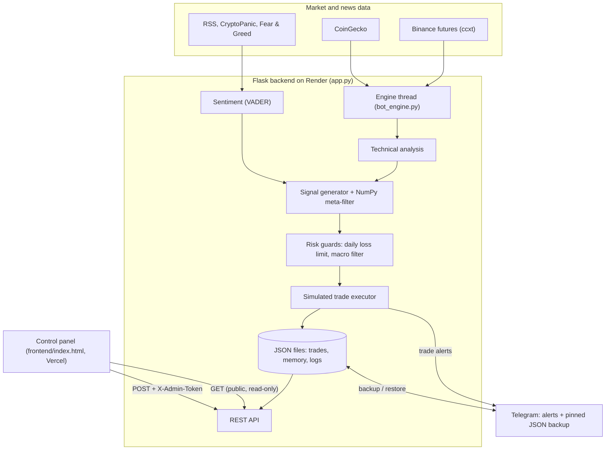
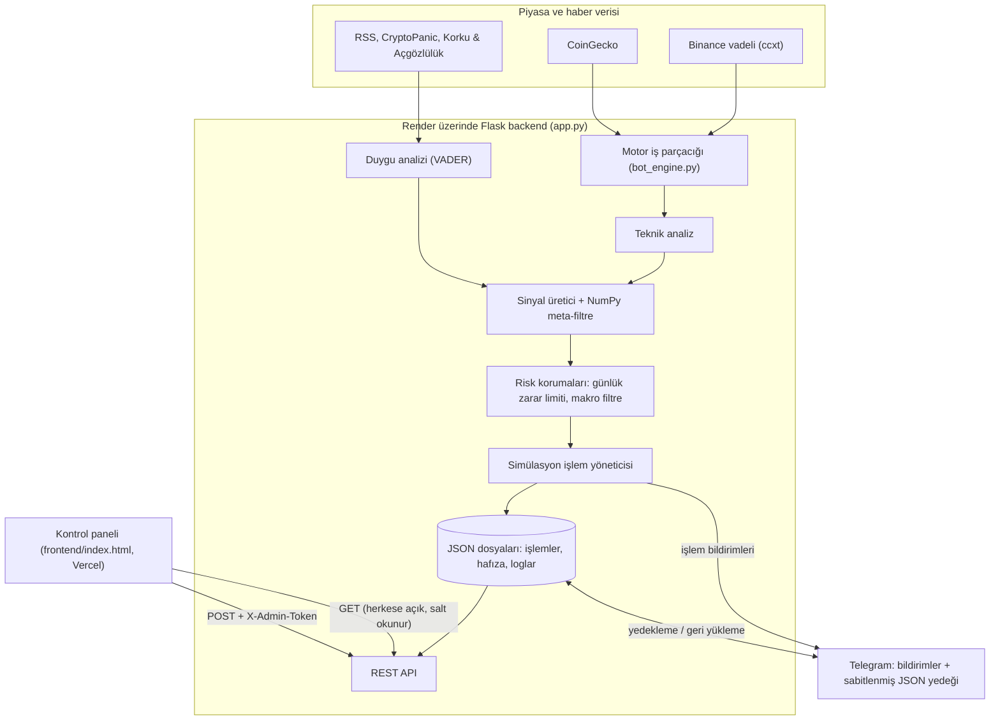

# coin-proje-bot2: Crypto Signal & Simulation Bot (earlier iteration)

A Python bot that scores BTC and SOL setups from technical indicators, news sentiment and a small self-trained NumPy model, then manages **simulated** long/short trades through a Flask API, a web control panel and Telegram alerts.

[](https://github.com/CoskunerBerke/coin-proje-bot2/actions/workflows/ci.yml)


> **Status: predecessor of [trading2](https://github.com/CoskunerBerke/trading2), simulation only.**
> This was one of my first trading-bot projects. The ideas were rebuilt later, with a much stricter paper-trading and
> measurement approach, in trading2. This bot never places real orders: the engine is locked to simulation mode on a
> virtual 1,000 USDT balance. Nothing here is financial advice.



<sub>All screenshots come from the offline demo (`scripts/demo_server.py`): synthetic market data from a seeded random walk and fictional simulated trades. The market-cap card shows $0 because CoinGecko is not called offline.</sub>

| Simulated trades and balance | Learning and performance panel | Mobile |
|---|---|---|
|  |  |  |

## Overview

The engine scans the coins in `ACTIVE_COINS` (BTC and SOL, see `config.py`) on short timeframes, scores each setup, applies risk filters and opens virtual positions sized by stop distance. Every closed trade feeds a learning step that re-weights the signal factors and retrains a small logistic-regression meta-filter. A Flask app exposes the data as a REST API and starts the engine in a background thread; a static HTML panel (Tailwind) reads that API. An optional local Streamlit dashboard (`main.py`) uses the same modules directly. This repository is the "BOT2_AGGRESSIVE" profile (lower confidence threshold, macro filter enabled).

## Features

- **Technical analysis**: RSI, MACD, EMA 9/21/50/200, Bollinger Bands, ADX, ATR, support/resistance, pivot level, candle body/wick ratio, multi-timeframe alignment and market-regime detection.
- **Sentiment analysis**: RSS feeds (and CryptoPanic when a key is set), scored with VADER, plus the Fear & Greed index.
- **Weighted long/short signal**: eight factors (EMA crossover, RSI, MACD, sentiment, Bollinger, ADX trend, volume, candle pattern); hard and soft reject reasons are shown in the panel.
- **Self-adjusting weights**: factor weights are re-estimated from closed trades over 50/200/1000-trade windows, and a NumPy logistic-regression meta-filter is retrained on the same history (`update_weights_from_history`).
- **Simulated trade management**: position sizing by stop distance, fixed 3x leverage, partial take-profit (TP1/TP2), regime-aware trailing stops, structure exits, time barriers.
- **Risk guards**: no new entries for the day after 3 consecutive losses or -3 % on the day; macro "crisis" filter (USD/TRY, BTC dominance, total market-cap change, Fear & Greed).
- **Counterfactual analysis and coin memory**: "what if I had entered / held?" tracking and a per-coin trade history profile.
- **Long-term spot scanner**: daily-chart checks (EMA breakouts, RSI accumulation zone).
- **REST API + control panel**: trades, skipped trades, memory, logs, balance, settings and per-coin analysis. Read-only views are public; every state-changing call needs an admin token. The one side effect a public request can have is the rate-limited Telegram backup pull described under [Security notes](#security-notes).
- **Telegram**: trade alerts and a pinned JSON backup of the trade data that is pulled back on restart.

## Architecture



## Tech stack

| Area | Tools |
|---|---|
| Backend | Python 3.10, Flask, Flask-CORS |
| Data and analysis | ccxt (Binance), CoinGecko REST, pandas, NumPy, `ta`, vaderSentiment, feedparser |
| Frontend | Single-page HTML, Tailwind CSS (CDN), Font Awesome |
| Local dashboard | Streamlit, Plotly |
| Tests and CI | pytest (Flask test client, no network), GitHub Actions |
| Hosting | Render (`Procfile`), Vercel (`vercel.json`), Telegram as backup store |

## Project structure

```text
coin-proje-bot2/
├── app.py                    # Flask REST API, admin-token checks, starts the engine thread
├── bot_engine.py             # 24/7 loop: scan -> signal -> risk guards -> simulated trades
├── data_fetcher.py           # Binance (ccxt) + CoinGecko data
├── technical_analysis.py     # indicators, levels, regimes, candle patterns
├── sentiment_analysis.py     # RSS / CryptoPanic news + VADER, Fear & Greed
├── signal_generator.py       # weighted signal, meta-filter, learning step
├── trade_executor.py         # simulated positions, stops, take-profits
├── coin_intelligence.py, counterfactual_analyzer.py, macro_sentinel.py, spot_investor.py
├── db_manager.py             # JSON trade store + Telegram backup/restore
├── telegram_notifier.py
├── config.py                 # coins, timeframes, weights, risk thresholds
├── frontend/index.html       # control panel (deployed on Vercel)
├── main.py, dashboard.py     # optional local Streamlit dashboard
├── scripts/demo_server.py    # offline demo: real API on synthetic market data
├── tests/                    # pytest suite (API auth, CORS, trade logic, RSS, demo)
├── analyze_performance.py, merge_and_push.py   # the author's maintenance scripts
├── docs/screenshots/         # README screenshots (offline demo)
└── DEPLOYMENT.md             # Render + UptimeRobot guide (Turkish)
```

## Quick start

### Offline demo (no API keys, simulated market data)

```bash
git clone https://github.com/CoskunerBerke/coin-proje-bot2.git
cd coin-proje-bot2
python3.10 -m venv .venv && source .venv/bin/activate
pip install -r requirements.txt

python scripts/demo_server.py                 # API on http://localhost:5000, data in ./demo-data
python -m http.server 8080 -d frontend        # second terminal: panel on http://localhost:8080
```

The demo seeds fictional trades, disables the engine thread and replaces the Binance and CoinGecko calls with a seeded random walk. The news calls are stubbed: the news lists come back empty and the Fear & Greed index is a fixed neutral 50. Signals, levels and statistics on the panel are computed by the real code from that synthetic data. The demo API makes no outbound network calls (the Telegram variables are blanked), but the panel page still loads Tailwind (cdn.tailwindcss.com), Google Fonts and Font Awesome (cdnjs) from CDNs, so the browser needs internet access to show it styled. Admin actions answer 503 until you start the demo with `ADMIN_TOKEN=<something> python scripts/demo_server.py`.

### Against live market data

```bash
cp .env.example .env          # set ADMIN_TOKEN; everything else is optional
python app.py                 # API + engine on http://localhost:5000
```

Serve the panel as above and add `CORS_ORIGINS=http://localhost:8080` to `.env`. Needs outbound access to Binance and CoinGecko.

> On its first start in a fresh clone the backend merges `seed_restore.json` (the author's own simulated trade history) into the local JSON files and then **deletes** that file, and it archives closed trades into `bot_trades_archive_*.json`. Run `git checkout -- seed_restore.json` to get the file back.

The local Streamlit dashboard starts with `streamlit run main.py` (http://localhost:8501).

## Configuration

All values come from environment variables (or `.env`, see `.env.example`). Names only:

| Variable | Used for | When unset |
|---|---|---|
| `ADMIN_TOKEN` | Required `X-Admin-Token` header for `POST /api/settings`, `/api/close-trade/<id>`, `/api/telegram-test`, `/api/memory-report`, `/api/danger-reset-db` | those endpoints return 503 |
| `CORS_ORIGINS` | Comma-separated panel origins allowed to call the API from a browser | same-origin only |
| `TELEGRAM_TOKEN` | Bot token for alerts and the cloud backup (masked in `GET /api/settings`, redacted from logs) | Telegram off |
| `TELEGRAM_CHAT_ID` | Chat for trade alerts and the memory report | Telegram off |
| `TELEGRAM_DATA_CHAT_ID` | Chat for the pinned JSON backup | falls back to `TELEGRAM_CHAT_ID` |
| `CRYPTOPANIC_API_KEY` | Extra news source | RSS feeds only |
| `PORT` | HTTP port | `5000` |
| `RENDER` | Set by Render; keeps the engine active there | engine follows the saved `bot_active` setting |
| `DISABLE_BOT_ENGINE` | `1` starts the API without the engine thread (tests, demo) | engine starts |
| `BINANCE_API_KEY`, `BINANCE_SECRET_KEY` | Read by `config.py`; not needed because the engine is locked to simulation | — |

`REDDIT_CLIENT_ID` / `REDDIT_CLIENT_SECRET` in `.env.example` and `BACKEND_URL` in `config.py` are currently unused.

## Testing

```bash
pip install -r requirements-dev.txt
python -m pytest
```

78 tests, all offline: admin-token checks on every state-changing endpoint (503 without `ADMIN_TOKEN`, 401 for a missing or wrong token), public GET requests leaving the data files, the log and the coin list untouched, the CORS allow-list, token masking in settings and logs, coin-symbol validation, manual-close timestamps, the daily loss guard (on a frozen clock), Telegram credential fallbacks, the RSS timeout and the demo data. GitHub Actions runs byte-compilation and the same suite on every push and pull request.

## Deployment

- **Backend (Render):** web service started by the `Procfile` (`web: python app.py`), Python version from `runtime.txt`. Set `ADMIN_TOKEN` (a long random value) and `CORS_ORIGINS` (the Vercel panel URL), plus the Telegram variables for alerts and backups.
- **Panel (Vercel):** `vercel.json` serves `frontend/index.html` as a static site. The panel's default API address is `https://coin-proje-bot2.onrender.com`; another backend can be entered in the panel.
- Render's disk is not persistent. Open positions and the coin memory survive restarts through the pinned Telegram backup; closed trades are archived on each fresh start (see the limitations below). UptimeRobot keep-alive setup (Turkish): [DEPLOYMENT.md](DEPLOYMENT.md).

## Security notes

- The panel asks for the admin token once per browser tab, keeps it in `sessionStorage` and sends it only with state-changing requests. The server compares it in constant time.
- `GET /api/settings` reports only whether a Telegram token is set (`tg_token_set`), never the token itself.
- The bot log is public (`GET /api/logs`). Telegram calls carry the token in the URL and network errors repeat that URL, so every log line is redacted before it is written, and again when the endpoint serves older lines.
- Public GET requests do not change server state, with one exception: `GET /api/trades` and `GET /api/avoided` start a background pull of the pinned Telegram backup, at most once every 20 seconds. That pull can refresh the local JSON files from the backup and add a line to the bot log (for example when Telegram is not configured). The coin analysis writes its filter lines to the server console, not to the shared bot log.
- Coin symbols in `/api/analysis/<coin>/<timeframe>` must match `^[A-Z0-9]{2,15}$`. A custom coin is analysed for that request only (404 when the exchange lookup fails) and is never added to the shared coin list; the panel keeps it in the visitor's own sidebar until the page is reloaded.
- The panel still loads Tailwind (script), Google Fonts and Font Awesome (cdnjs stylesheet) from public CDNs.
- `app.py` runs Flask's built-in server, as before; a WSGI server would be the next step for anything beyond a hobby deployment.

## Status and known limitations

- Retired predecessor of trading2: kept working and tested, not developed further.
- Storage is plain JSON files plus a Telegram backup, not a database.
- `/api/danger-reset-db` imports `scratch.archive_and_reset_data`, a local helper that is not in this repository, so the endpoint returns 500 even with a valid admin token.
- On every fresh start (for example a Render redeploy) closed trades are moved out of `bot_trades.json` into an archive file; the per-coin learning memory is kept.

## Disclaimer

Signals are probabilistic and produced for learning purposes. Crypto markets are highly volatile. This is not financial advice.

---

## Türkçe

**coin-proje-bot2**, BTC ve SOL kurulumlarını teknik göstergeler, haber duygu analizi ve kendi kendini eğiten küçük bir NumPy modeliyle puanlayan ve **simülasyon** long/short işlemlerini Flask API, web kontrol paneli ve Telegram bildirimleriyle yöneten bir Python botudur.

> **Durum: [trading2](https://github.com/CoskunerBerke/trading2) projesinin öncülü, sadece simülasyon.**
> İlk trading bot projelerimden biridir; fikirler daha sonra çok daha sıkı bir kâğıt işlem ve ölçüm yaklaşımıyla trading2'de
> yeniden yazıldı. Bu bot hiçbir zaman gerçek emir göndermez: motor 1.000 USDT'lik sanal bakiyeyle simülasyon moduna
> kilitlidir. Yatırım tavsiyesi değildir.

Ekran görüntüleri sayfanın başındadır. Hepsi çevrimdışı demodan (`scripts/demo_server.py`) alınmıştır: sabit tohumlu rastgele yürüyüşle üretilmiş sentetik piyasa verisi ve tamamen kurgusal simülasyon işlemleri. Çevrimdışı modda CoinGecko çağrılmadığı için piyasa değeri kartı $0 gösterir.

### Genel bakış

Motor, `ACTIVE_COINS` içindeki coinleri (BTC ve SOL, `config.py`) kısa zaman dilimlerinde tarar, her kurulumu puanlar, risk filtrelerini uygular ve stop mesafesine göre boyutlanan sanal pozisyonlar açar. Kapanan her işlem, sinyal faktörlerinin ağırlıklarını yeniden hesaplayan ve küçük bir lojistik regresyon meta-filtresini yeniden eğiten öğrenme adımına geri beslenir. Flask uygulaması verileri REST API olarak sunar ve motoru arka plan iş parçacığında başlatır; statik HTML paneli (Tailwind) bu API'yi okur. İsteğe bağlı yerel Streamlit paneli (`main.py`) aynı modülleri doğrudan kullanır. Bu depo "BOT2_AGGRESSIVE" profilidir (düşük güven eşiği, makro filtre açık).

### Özellikler

- **Teknik analiz:** RSI, MACD, EMA 9/21/50/200, Bollinger, ADX, ATR, destek/direnç, pivot, mum gövde/fitil oranı, çoklu zaman dilimi uyumu ve piyasa rejimi tespiti.
- **Duygu analizi:** RSS haberleri (anahtar varsa CryptoPanic), VADER puanlaması, Korku & Açgözlülük endeksi.
- **Ağırlıklı long/short sinyali:** 8 faktör (EMA kesişimi, RSI, MACD, duygu, Bollinger, ADX trendi, hacim, mum formasyonu); sert ve yumuşak red sebepleri panelde gösterilir.
- **Kendini ayarlayan ağırlıklar:** ağırlıklar kapanan işlemlerden 50/200/1000 işlemlik pencerelerle yeniden hesaplanır; NumPy lojistik regresyon meta-filtresi aynı geçmişle yeniden eğitilir (`update_weights_from_history`).
- **Simülasyon işlem yönetimi:** stop mesafesine göre boyut, sabit 3x kaldıraç, kademeli kâr alma (TP1/TP2), rejime duyarlı takip stopu, yapısal çıkış, zaman bariyerleri.
- **Risk korumaları:** üst üste 3 zarar veya gün içinde -%3 sonrasında o gün yeni işlem açılmaz; makro "kriz" filtresi (USD/TRY, BTC dominansı, toplam piyasa değeri değişimi, Korku & Açgözlülük).
- **Karşı-olgusal analiz ve coin hafızası:** "girseydim / tutsaydım ne olurdu?" takibi ve coin bazlı işlem geçmişi profili.
- **Uzun vadeli spot tarayıcı:** günlük grafikte EMA kırılımı ve RSI birikim bölgesi kontrolleri.
- **REST API + kontrol paneli:** işlemler, atlanan işlemler, hafıza, loglar, bakiye, ayarlar ve coin analizi. Okuma ekranları herkese açıktır; durum değiştiren her çağrı yönetici anahtarı ister. Herkese açık bir isteğin tek yan etkisi, [Güvenlik notları](#güvenlik-notları) bölümünde anlatılan, sıklığı sınırlı Telegram yedek çekmesidir.
- **Telegram:** işlem bildirimleri ve yeniden başlatmada geri yüklenen sabitlenmiş JSON yedeği.

### Mimari



### Teknoloji

| Alan | Araçlar |
|---|---|
| Backend | Python 3.10, Flask, Flask-CORS |
| Veri ve analiz | ccxt (Binance), CoinGecko REST, pandas, NumPy, `ta`, vaderSentiment, feedparser |
| Panel | Tek sayfa HTML, Tailwind CSS (CDN), Font Awesome |
| Yerel panel | Streamlit, Plotly |
| Test ve CI | pytest (Flask test istemcisi, ağ yok), GitHub Actions |
| Yayın | Render (`Procfile`), Vercel (`vercel.json`), yedek deposu olarak Telegram |

### Proje yapısı

```text
coin-proje-bot2/
├── app.py                    # Flask REST API, yönetici anahtarı kontrolleri, motoru başlatır
├── bot_engine.py             # 7/24 döngü: tarama -> sinyal -> risk korumaları -> simülasyon işlemleri
├── data_fetcher.py           # Binance (ccxt) + CoinGecko verisi
├── technical_analysis.py     # göstergeler, seviyeler, rejimler, mum formasyonları
├── sentiment_analysis.py     # RSS / CryptoPanic haberleri + VADER, Korku & Açgözlülük
├── signal_generator.py       # ağırlıklı sinyal, meta-filtre, öğrenme adımı
├── trade_executor.py         # simülasyon pozisyonları, stoplar, kâr alma
├── coin_intelligence.py, counterfactual_analyzer.py, macro_sentinel.py, spot_investor.py
├── db_manager.py             # JSON işlem deposu + Telegram yedekleme/geri yükleme
├── telegram_notifier.py
├── config.py                 # coinler, zaman dilimleri, ağırlıklar, risk eşikleri
├── frontend/index.html       # kontrol paneli (Vercel)
├── main.py, dashboard.py     # isteğe bağlı yerel Streamlit paneli
├── scripts/demo_server.py    # çevrimdışı demo: sentetik veriyle gerçek API
├── tests/                    # pytest (API yetkilendirme, CORS, işlem mantığı, RSS, demo)
├── analyze_performance.py, merge_and_push.py   # yazarın bakım betikleri
├── docs/screenshots/         # README ekran görüntüleri (çevrimdışı demo)
└── DEPLOYMENT.md             # Render + UptimeRobot rehberi
```

### Hızlı başlangıç

Çevrimdışı demo (API anahtarı gerekmez, piyasa verisi simüle edilir):

```bash
git clone https://github.com/CoskunerBerke/coin-proje-bot2.git
cd coin-proje-bot2
python3.10 -m venv .venv && source .venv/bin/activate
pip install -r requirements.txt

python scripts/demo_server.py                 # API: http://localhost:5000, veriler ./demo-data içinde
python -m http.server 8080 -d frontend        # ikinci terminal: panel http://localhost:8080
```

Demo kurgusal işlemler oluşturur, motor iş parçacığını kapatır ve Binance ile CoinGecko çağrılarını sabit tohumlu rastgele yürüyüşle değiştirir. Haber çağrıları devre dışıdır: haber listeleri boş döner, Korku & Açgözlülük endeksi sabit ve nötr (50) kabul edilir. Paneldeki sinyal, seviye ve istatistikler gerçek kod tarafından bu sentetik veriden hesaplanır. Demo API'si dışarıya hiçbir ağ çağrısı yapmaz (Telegram değişkenleri boşaltılır); ancak panel sayfası Tailwind'i (cdn.tailwindcss.com), Google Fonts'u ve Font Awesome'ı (cdnjs) hâlâ CDN'lerden yükler, bu yüzden düzgün görünmesi için tarayıcının internete erişmesi gerekir. Yönetici işlemleri, demo `ADMIN_TOKEN=<değer> python scripts/demo_server.py` ile başlatılmadıkça 503 döner.

Canlı piyasa verisiyle:

```bash
cp .env.example .env          # ADMIN_TOKEN girin; gerisi isteğe bağlı
python app.py                 # API + motor: http://localhost:5000
```

Paneli yukarıdaki gibi sunun ve `.env` dosyasına `CORS_ORIGINS=http://localhost:8080` ekleyin. Binance ve CoinGecko erişimi gerekir.

> Temiz bir klonda ilk açılışta backend, `seed_restore.json` dosyasını (yazarın kendi simülasyon geçmişi) yerel JSON dosyalarıyla birleştirir ve ardından bu dosyayı **siler**; kapalı işlemleri de `bot_trades_archive_*.json` dosyasına arşivler. Dosyayı geri almak için: `git checkout -- seed_restore.json`.

Yerel Streamlit paneli `streamlit run main.py` ile açılır (http://localhost:8501).

### Yapılandırma

Tüm değerler ortam değişkenlerinden (veya `.env`, bkz. `.env.example`) okunur. Sadece adlar:

| Değişken | Kullanım | Tanımsızsa |
|---|---|---|
| `ADMIN_TOKEN` | `POST /api/settings`, `/api/close-trade/<id>`, `/api/telegram-test`, `/api/memory-report`, `/api/danger-reset-db` için zorunlu `X-Admin-Token` başlığı | bu uç noktalar 503 döner |
| `CORS_ORIGINS` | API'yi tarayıcıdan çağırabilecek panel adresleri (virgülle ayrılmış) | yalnızca aynı origin |
| `TELEGRAM_TOKEN` | Bildirim ve bulut yedeği için bot token'ı (`GET /api/settings`'te gizlenir, loglardan silinir) | Telegram kapalı |
| `TELEGRAM_CHAT_ID` | İşlem bildirimleri ve hafıza raporu kanalı | Telegram kapalı |
| `TELEGRAM_DATA_CHAT_ID` | Sabitlenmiş JSON yedeği kanalı | `TELEGRAM_CHAT_ID` kullanılır |
| `CRYPTOPANIC_API_KEY` | Ek haber kaynağı | sadece RSS |
| `PORT` | HTTP portu | `5000` |
| `RENDER` | Render tarafından atanır; motoru orada aktif tutar | kayıtlı `bot_active` ayarı geçerli |
| `DISABLE_BOT_ENGINE` | `1` ise API motor olmadan başlar (test, demo) | motor başlar |
| `BINANCE_API_KEY`, `BINANCE_SECRET_KEY` | `config.py` okur; motor simülasyona kilitli olduğu için gerekmez | — |

`.env.example` içindeki `REDDIT_CLIENT_ID` / `REDDIT_CLIENT_SECRET` ve `config.py` içindeki `BACKEND_URL` şu an kullanılmıyor.

### Testler

```bash
pip install -r requirements-dev.txt
python -m pytest
```

78 test, hepsi çevrimdışı: durum değiştiren her uç noktada yönetici anahtarı kontrolü (`ADMIN_TOKEN` yoksa 503, anahtar eksik/yanlışsa 401), herkese açık GET isteklerinin veri dosyalarını, logu ve coin listesini değiştirmemesi, CORS izin listesi, ayarlarda ve loglarda token gizleme, coin sembolü doğrulaması, manuel kapatma zaman damgası, günlük zarar koruması (sabitlenmiş saatle), Telegram ayar geri düşüşleri, RSS zaman aşımı ve demo verisi. GitHub Actions her push ve pull request'te derleme kontrolünü ve aynı test paketini çalıştırır.

### Yayına alma

- **Backend (Render):** `Procfile` (`web: python app.py`) ile başlayan web servisi, Python sürümü `runtime.txt`. `ADMIN_TOKEN` (uzun rastgele bir değer) ve `CORS_ORIGINS` (Vercel panel adresi) tanımlanmalı; bildirim ve yedek için Telegram değişkenleri eklenir.
- **Panel (Vercel):** `vercel.json`, `frontend/index.html` dosyasını statik site olarak sunar. Panelin varsayılan API adresi `https://coin-proje-bot2.onrender.com`; panelden başka bir backend adresi girilebilir.
- Render diski kalıcı değildir. Açık pozisyonlar ve coin hafızası yeniden başlatmalarda Telegram'daki sabitlenmiş yedekle korunur; kapalı işlemler her temiz açılışta arşivlenir (aşağıdaki sınırlamalara bakın). UptimeRobot ile uyanık tutma adımları: [DEPLOYMENT.md](DEPLOYMENT.md).

### Güvenlik notları

- Panel yönetici anahtarını tarayıcı sekmesi başına bir kez sorar, `sessionStorage`'da tutar ve sadece durum değiştiren isteklerde gönderir; sunucu anahtarı sabit zamanlı karşılaştırır.
- `GET /api/settings` Telegram token'ını asla döndürmez, sadece kayıtlı olup olmadığını (`tg_token_set`) bildirir.
- Bot logu herkese açıktır (`GET /api/logs`). Telegram çağrıları token'ı URL'de taşır ve ağ hataları bu URL'yi tekrarlar; bu yüzden her log satırı yazılmadan önce temizlenir, uç nokta eski satırları sunarken de tekrar temizler.
- Herkese açık GET istekleri sunucu durumunu değiştirmez; tek istisna: `GET /api/trades` ve `GET /api/avoided`, en fazla 20 saniyede bir, sabitlenmiş Telegram yedeğini arka planda çeker. Bu çekme yerel JSON dosyalarını yedekten güncelleyebilir ve bot loguna bir satır ekleyebilir (ör. Telegram ayarlı değilse). Coin analizi filtre satırlarını ortak bot loguna değil, sunucu konsoluna yazar.
- `/api/analysis/<coin>/<timeframe>` içindeki coin sembolü `^[A-Z0-9]{2,15}$` olmalıdır. Özel coin sadece o istek için analiz edilir (borsa sorgusu başarısız olursa 404) ve ortak coin listesine asla eklenmez; panel onu sayfa yenilenene kadar yalnızca o ziyaretçinin kenar çubuğunda tutar.
- Panel Tailwind'i (script), Google Fonts'u ve Font Awesome'ı (cdnjs stil dosyası) hâlâ herkese açık CDN'lerden yükler.
- `app.py` önceden olduğu gibi Flask'ın yerleşik sunucusunu kullanır; hobi ölçeğinin ötesinde bir yayın için sıradaki adım bir WSGI sunucusudur.

### Durum ve bilinen sınırlamalar

- trading2'nin emekliye ayrılmış öncülü: çalışır ve testli tutuluyor, geliştirilmiyor.
- Depolama veritabanı değil, JSON dosyaları ve Telegram yedeğidir.
- `/api/danger-reset-db`, bu depoda bulunmayan yerel `scratch.archive_and_reset_data` yardımcı modülünü içe aktarır; bu yüzden geçerli anahtarla bile 500 döner.
- Her temiz açılışta (ör. Render'da yeniden dağıtım) kapalı işlemler `bot_trades.json` dosyasından bir arşiv dosyasına taşınır; coin bazlı öğrenme hafızası korunur.

### Uyarı

Sinyaller olasılığa dayalıdır ve öğrenme amacıyla üretilmiştir. Kripto piyasaları çok oynaktır. Yatırım tavsiyesi değildir.

---

Built by [Berke Coşkuner](https://github.com/CoskunerBerke)
