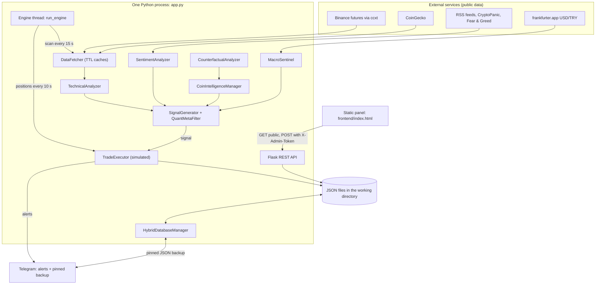
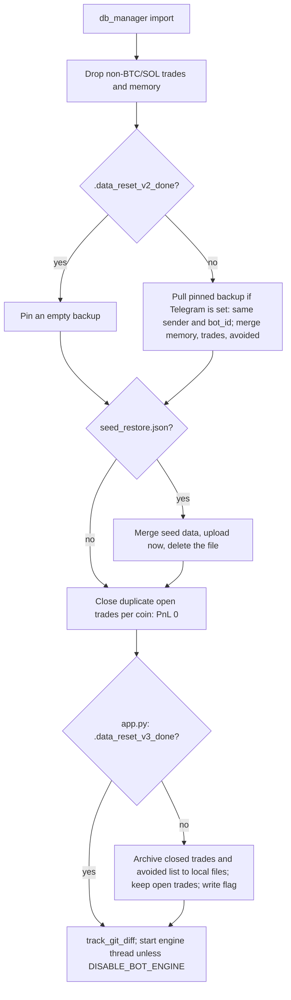
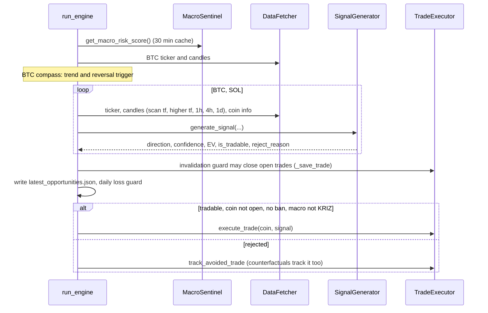
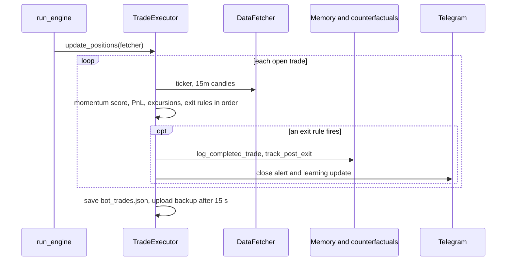
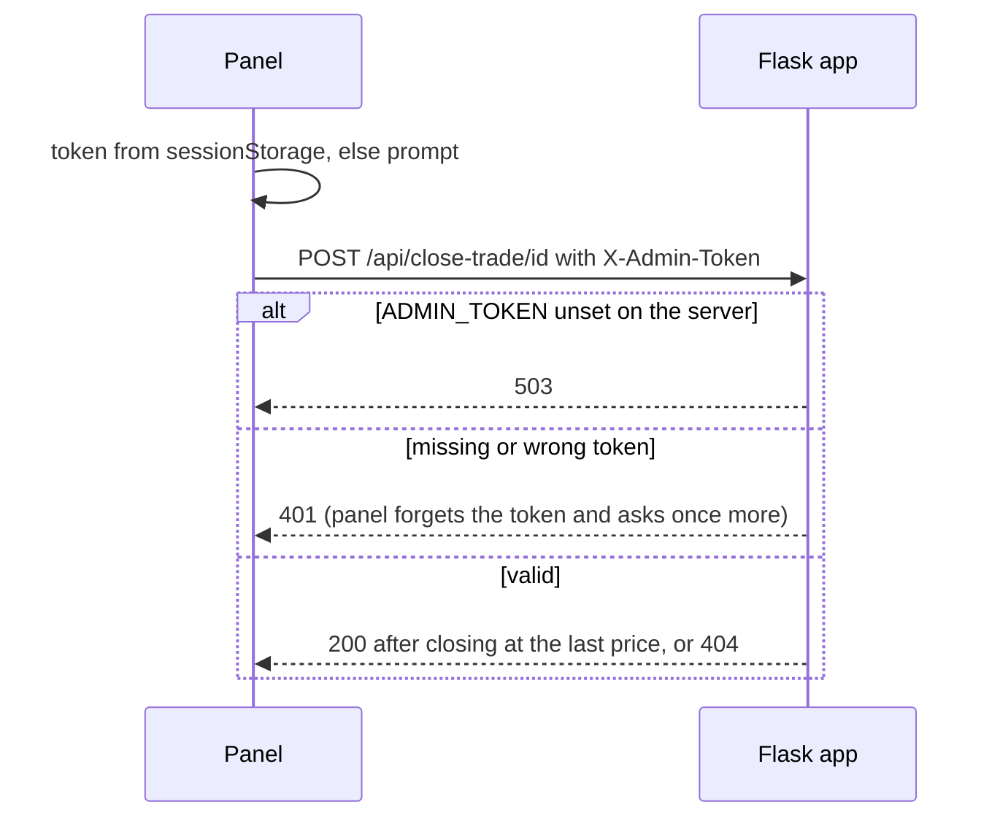
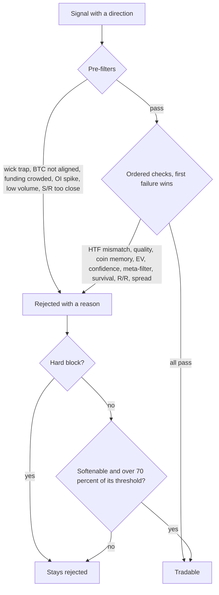

# How coin-proje-bot2 works

The English entry point to the code, for an engineer who has never opened the repository. Every statement was checked
against the code at the commit that last changed this file, and each mechanism links to the module and function behind
it. Code comments and log messages are in Turkish; the [glossary](#10-glossary) translates the field names.

> **Early prototype, kept for reference.** One of the author's first trading-bot experiments, superseded by
> [trading2](https://github.com/CoskunerBerke/trading2). It only simulates trades: no code in this repository places an
> exchange order. Nothing here claims that any strategy is profitable.

## Contents

1. [What it is and what it is not](#1-what-it-is-and-what-it-is-not)
2. [Architecture](#2-architecture)
3. [Main runtime flows](#3-main-runtime-flows)
4. [Data model](#4-data-model)
5. [Core logic in depth](#5-core-logic-in-depth)
6. [Design decisions and trade-offs](#6-design-decisions-and-trade-offs)
7. [Testing strategy](#7-testing-strategy)
8. [Limitations, known gaps and next steps](#8-limitations-known-gaps-and-next-steps)
9. [Code tour](#9-code-tour)
10. [Glossary](#10-glossary)
11. [Türkçe özet](#türkçe-özet)

## 1. What it is and what it is not

**What it is.** One Python process ([`app.py`](../app.py)) that serves a Flask REST API and runs a background engine
thread. The engine reads public Binance futures data for `ACTIVE_COINS` (BTC and SOL, [`config.py`](../config.py)),
scores long/short setups with hand-written indicator rules, filters them and opens **simulated** 3x positions on a
virtual balance that starts at 1,000 USDT. Closed trades feed a per-coin memory and a small logistic-regression
"meta-filter". A static panel ([`frontend/index.html`](../frontend/index.html)) reads the API; Telegram gets alerts and a
pinned JSON backup.

**What it is not.** Not a live trading system: [`run_engine`](../bot_engine.py) forces `sim_mode = True` and leverage 3
on every loop, and nothing calls an order-placing exchange method. Not a validated strategy: "confidence" and "EV" come
from hand-tuned formulas, and there is no backtest. Not maintained: it is kept working and tested, and the unreachable
branches and bugs found while writing this file are listed in [section 8](#8-limitations-known-gaps-and-next-steps).

## 2. Architecture

| Module | Responsibility |
|---|---|
| [`app.py`](../app.py) | Routes, `require_admin`, CORS, one-time archive on a fresh start, engine thread start |
| [`bot_engine.py`](../bot_engine.py) | The 24/7 loop, BTC "compass", invalidation guard, daily loss guard |
| [`data_fetcher.py`](../data_fetcher.py) | Candles, tickers, funding, open interest, spread (ccxt), CoinGecko; TTL cache |
| [`technical_analysis.py`](../technical_analysis.py) | Indicators, support/resistance, regime, squeeze, sweeps |
| [`signal_generator.py`](../signal_generator.py) | Rule votes, confidence, SL/TP, Monte Carlo, EV, filters, meta-filter |
| [`coin_intelligence.py`](../coin_intelligence.py) | Per-coin profiles ("DNA") and trade memory |
| [`sentiment_analysis.py`](../sentiment_analysis.py), [`macro_sentinel.py`](../macro_sentinel.py) | News score; macro risk level |
| [`trade_executor.py`](../trade_executor.py) | Sizing, simulated entries and exits, balance, avoided trades |
| [`counterfactual_analyzer.py`](../counterfactual_analyzer.py) | "What if I had held / had entered" for 24 h |
| [`db_manager.py`](../db_manager.py), [`telegram_notifier.py`](../telegram_notifier.py) | Start-up clean-up, Telegram backup/restore; messages |

`main.py` and `dashboard.py` are an older local Streamlit front end over the same modules (it starts its own engine
thread). `analyze_performance.py` and `merge_and_push.py` are offline maintenance scripts.

### 2.1 Threads and shared files

All state lives in JSON files that four kinds of thread read and write:

| Thread | Started by | Writes |
|---|---|---|
| `BotEngineThread` | `start_bot_thread` when `app.py` is imported | trades, avoided trades, opportunities, counterfactuals (temp file + `os.replace`); coin memory, spot portfolio, log (plain overwrite) |
| Flask request threads | each HTTP request | `/api/close-trade` rewrites `bot_trades.json` (temp + replace); `POST /api/settings` overwrites `persistent_settings.json` |
| Cloud pull | `sync_db_async` on `GET /api/trades` or `/api/avoided`, at most every 20 s | merges the pinned backup into memory, trades and avoided trades (plain overwrite) |
| Upload timer | `push_to_cloud`, 15 s after the last trade-file write (debounced) | reads trades, avoided trades and memory; sends `db_backup.json` |

There is no file lock. `HybridDatabaseManager.lock` serialises only the cloud pull and the upload with each other; the
engine and the request threads never take it. Atomic replace keeps readers away from half-written trade files written
by the engine or the close route, but it does not prevent lost updates: [`update_positions`](../trade_executor.py) reads
the whole list, makes network calls and writes the list back, so an admin close in between is overwritten, and the
cloud pull can overwrite a newer engine write with its merge. The engine and the close route also share the temp name
`bot_trades.json.tmp`. [`get_trade_history`](../trade_executor.py) returns `[]` when the file does not parse, so if
`_save_trade`'s own read lands inside the pull's plain overwrite, it writes a history that holds only the new trade.

## 3. Main runtime flows

### 3.1 Start-up and restart

The state after a restart is decided before the engine runs. Importing `app.py` imports `bot_engine` →
`trade_executor` → `db_manager`, whose module-level `HybridDatabaseManager()` runs the first steps;
`app.py` runs the rest.

The flag files are git-ignored and do not survive a restart on a host without a persistent disk (Render, which the
code comments name), so there every fresh start pulls the backup and then archives the closed trades. What follows:

- `bot_trades.json` holds only open trades until something closes. The balance then falls back to the coin memory
  ([4.1](#41-the-simulated-balance)), the meta-filter has no training data (it needs 20 closed trades) and its threshold
  uses its defaults.
- The pinned backup still contains the closed trades until the next upload. With Telegram configured, a
  `GET /api/trades` or `/api/avoided` in that window merges them back into `bot_trades.json`; once the engine writes the
  trade file, the following upload replaces the backup with the trimmed list. Whether the closed history survives a
  restart therefore depends on timing.
- `seed_restore.json` is committed, so a fresh clone merges its 15 trades (two of them open), 59 avoided records and 13
  memory entries, uploads the result when Telegram is configured and deletes the file. The two open trades become
  simulated positions that the engine manages at current prices. Running this sequence in a directory holding only
  `seed_restore.json` (Telegram unset) left 2 open trades in `bot_trades.json`, 13 closed ones in the archive and a
  balance of 1,002.54 USDT.
- Duplicate-cleanup closes never reach the coin memory. `.data_reset_v2_done` is only read: no code in the repository
  creates it.

### 3.2 The engine loop and one scan

[`run_engine`](../bot_engine.py) waits 30 s after start-up, then loops with a 5 s pause and reloads
`persistent_settings.json` each time. On their own timers it updates open positions (10 s), counterfactuals (30 s) and
the daily-chart spot scan (12 h), and retrains the meta-filter on every iteration; all of these run even when the bot
is inactive. Scans and entries run every 15 s only when the bot is active (`RENDER=true` or the saved `bot_active`),
on the saved `timeframe` (default `1h`).

### 3.3 Position update

### 3.4 An admin request from the panel

A manual close computes the PnL and saves the list, but does not call `log_completed_trade`: it never reaches the coin
memory.

## 4. Data model

Everything is JSON in the working directory (git-ignored): `bot_trades.json` (trades, newest first),
`bot_avoided_trades.json` (rejected signals tracked against their own SL/TP for 24 h), `coin_trade_memory.json` (last
100 logged trades per coin as a 6-number vector plus a 0/1 outcome), `counterfactual_data.json` and
`counterfactual_lessons.json`, `latest_opportunities.json` (last scan), `bot_spot_portfolio.json`, `bot_logs.txt` (last
100 lines, redacted) and `persistent_settings.json` (panel settings).

| Trade field | Meaning |
|---|---|
| `id` | `str(int(timestamp))`, whole seconds |
| `coin`, `yon`, `durum` | Coin; `LONG`/`SHORT`; `AÇIK` (open) or `KAPALI` (closed) |
| `giris_fiyati`, `stop_loss`, `take_profit`, `cikis_fiyati` | Entry, current stop, target, exit |
| `miktar_usdt`, `kaldirac` | Margin in USDT; leverage (3) |
| `pnl_yuzde`, `pnl_usdt` | Leveraged PnL after 2 × 0.04 % commission |
| `support_level`, `resistance_level` | 1h 20-candle low/high at entry |
| `ml_data`, `entry_features`, `market_regime` | Indicator snapshot reused as training features; regime at entry |
| `max_favorable_excursion`, `max_adverse_excursion`, `realized_R_multiple` | Excursions and exit move in R as measured in [5.6](#56-the-simulated-trade-executor) |
| `tp1_hit`, `tp1_pnl_usdt`, `trailing_active` | Partial take-profit and trailing state |
| `exit_reason`, `quality_score`, `outcome` | Why it closed; 0 to 100 score; 0/1 label |

### 4.1 The simulated balance

The balance is derived on every call, never stored. [`get_balance`](../trade_executor.py) starts from 1,000 USDT
(`BOT_SETTINGS["starting_balance"]`), adds the `pnl_usdt` of closed trades in `bot_trades.json` and the booked TP1 part
of open trades; unrealised PnL is not counted. When `bot_trades.json` holds no closed trade, which is the normal state
right after a fresh start ([3.1](#31-start-up-and-restart)), it sums `pnl_usdt` over all entries of
`coin_trade_memory.json` and uses that sum instead whenever its absolute value is larger. The memory sum replaces the
TP1 part instead of adding to it, covers only what the memory still holds (logging keeps the last 100 entries per
coin) and leaves out manual and duplicate closes.

A probe on a scratch directory: one open trade with 5 USDT booked at TP1 gives 1,005.00; adding memory entries of −40
and −10 gives 950.00; once a trade closes with −2 USDT the fallback switches off and the balance jumps to 1,003.00.
This balance is the base of the margin, of the drawdown multiplier ([5.6](#56-the-simulated-trade-executor)) and of the
−3 % daily guard, so all three move with it.

## 5. Core logic in depth

### 5.1 Data and indicators

[`DataFetcher`](../data_fetcher.py) uses ccxt's Binance client with `defaultType: future`. Candles are cached with a TTL
that grows with the timeframe (25 s for 1m up to 7,200 s for 1d), tickers 10 s, funding/open interest/spread 2 min,
CoinGecko 2 h. Each scan loads 210 candles per timeframe so EMA 200 exists.
[`TechnicalAnalyzer.full_analysis`](../technical_analysis.py) returns RSI 14, MACD 12/26/9, EMA 9/21/50/200, Bollinger
20/2, ADX 14, ATR 14 and `atr_pct` (ATR as a percent of price), a 20-candle support/resistance pair, a trend (`LONG` if
close > EMA 21, else `SHORT`) and a regime from `detect_market_regime`: `COMPRESSION` (Bollinger width in its lowest
15 % of 100 candles), `VOLATILITY_EXPANSION` (width growing, volume > 1.8× average, realised volatility > 75 % of its
recent maximum), `TRENDING_BULL`/`_BEAR` (ADX > 25, EMAs 9/21/50 stacked, spread > 0.3 %), otherwise `RANGE`.

### 5.2 The weighted long/short vote

[`SignalGenerator.generate_signal`](../signal_generator.py) asks eight rule "experts" for a vote:

| Expert | Fires when | Score |
|---|---|---|
| Trend following | ADX > 22 | ±0.8 with the EMA 21 trend |
| Mean reversion | RSI < 32 or > 68 | ±0.7 against the extreme |
| Breakout | volume ratio > 1.6 and Bollinger width > 0.06 | ±0.6 |
| Scalping | MACD histogram ≠ 0 | ±0.5 with its sign |
| Volatility expansion | Bollinger width < 0.03 and volume ratio > 1.3 | ±0.7 |
| Liquidity sweep | large last-candle move and volume ratio > 1.8 | ±0.8, fading the move |
| Momentum continuation | ADX > 25 and volume ratio > 1.2 | ±0.6 by RSI vs 52 |
| Reversal | RSI < 35 in a down trend or > 65 in an up trend | ±0.5 |

The vote is `Σ score × w_regime × (w_coin × 8)`. `w_regime` is 0.05 unless the regime favours the expert (trend 0.40 and
momentum 0.30 when trending; mean reversion 0.45 and scalping 0.30 in a range, and so on). `w_coin` is the coin's fixed
indicator weight in `COIN_DEFAULT_DNA` ([`coin_intelligence.py`](../coin_intelligence.py)). A vote above +0.03 means
`LONG`, below −0.03 `SHORT`, else `NEUTRAL`. News sentiment is not part of the vote.

### 5.3 Confidence, targets, Monte Carlo and EV

- **Confidence** = 100 · sigmoid(`3.0·|vote| + 1.2·regime + 1.0·mtf + 0.5·funding + 0.5·oi − 0.8·uncertainty`).
  `regime` is +1 when the regime matches the direction, else −0.5; `mtf` ±1 when both timeframes' regimes agree;
  `funding` +1 when funding is against the crowd, else −0.3; `oi` 0.8 when open interest grew > 1 %, else −0.2;
  `uncertainty` is the standard deviation of the eight votes.
- **Stop/target** in ATRs: 2.0/4.5 when trending, 3.2/3.2 in volatility expansion, 1.5/2.5 otherwise; the target is
  stretched ×1.35 or ×1.15 for strong momentum and by the counterfactual exit-patience factor (5.7).
- **Monte Carlo**: 10,000 paths of 24 log-normal steps whose total volatility is one `atr_pct` and whose drift is
  `(p_win − 0.5)·reward·momentum_multiplier·atr_pct`; survival is the share of paths that never touch the stop.
- **EV** in ATR multiples: `p_win·reward·momentum_multiplier − (1 − p_win)·risk − (0.15 + 0.1·spread%)`, where `risk`
  and `reward` are the stop/target ATR multiples above (the code calls them `risk_r` and `reward_r` but never divides
  by the risk).
- **Trade quality** (0 to 100) is 30 plus points for ADX, EMA stacking, volume, RSI zone, MACD sign, higher-timeframe
  alignment and breakouts; below 75 it halves the size. **Entry quality** (0 to 1) weights trend alignment 0.30,
  breakout 0.25, volume 0.20, volatility 0.15, BTC alignment 0.10; below 0.35 it cuts confidence by 10 % and sets the
  quality multiplier to 0.7, at 0.75 or more it sets it to 1.2.
- **Adaptive threshold**: `42 + 2.5·atr% + 3·spread%`, moved for SOL by the BTC trend and reversal trigger and by the
  1d close vs EMA 200, capped at 75, then raised by the macro level.

### 5.4 Hard and soft rejects

The filters run in a fixed order and the first failure sets `reject_reason`. Because `AI_MODE` in
[`config.py`](../config.py) is `LEARN_AND_APPLY`, some rejections are then relaxed so the bot keeps collecting trades to
learn from (the reason given in the code comment).

| Class | Reasons |
|---|---|
| Hard | `BTC_CHAOTIC_VOLATILITY`, `WICK_TRAP_RISK`, `BTC_NOT_ALIGNED`, `FUNDING_OVERCROWDED_*`, `OI_SPIKE_SQUEEZE_RISK`, `VOLUME_TOO_LOW`, a coin-memory reason about edge or fakeout; and, whatever the reason, EV ≤ −0.10, survival < 25 %, reward/risk < 1.0 or spread ≥ 0.10 % |
| Soft, relaxed | confidence below threshold but above 70 % of it; meta-filter probability below threshold but above 70 % of it; HTF mismatch |
| Soft, kept | low quality, coin-memory mismatch or low combined score, S/R too close; `NEUTRAL` is never relaxed |

The rules behind the less obvious reasons:

- **Wick trap.** The "candle" is the ticker: open = bid, close = last price, high/low = the 24 h range. For a long the
  wick is `high − max(open, close)`, for a short `min(open, close) − low`. The signal is rejected when the wick is
  more than 60 % of the range and volume confirmation (`volume ratio / 2`, capped at 1) is below 0.50, that is a
  volume ratio below 1.0.
- **BTC not aligned.** BTC alignment is 1.0 when BTC's trend matches the direction, 0.6 when it is unknown and 0.2
  otherwise; below 0.40 rejects.
- **S/R distance.** Using the 1h 20-candle levels: a short closer than 1.5 % above support or a long closer than 1.5 %
  below resistance is rejected (`SUPPORT_TOO_CLOSE`, `RESISTANCE_TOO_CLOSE`); between 1.5 and 2.5 % the quality
  multiplier is halved.
- **Meta-filter threshold.** `max(0.15, min(0.35, win_rate − 0.10))`, plus 0.05 in `RANGE`, 0 when trending and 0.10
  in the other regimes, plus `min(0.05, 0.5·drawdown)`, so it lies between 0.15 and 0.50. `win_rate` is the share of
  label 1 among the last 100 closed trades in `bot_trades.json` after the grey-zone drop (5.7), 0.50 when there are
  none; `drawdown` is peak-to-current of 1,000 USDT plus the cumulative PnL of all closed trades in the file. With no
  history it is 0.35, 0.40 or 0.45 by regime, and an untrained filter (0.90) passes it.

`BTC_NOT_ALIGNED` fires when the BTC trend points the other way. The numbers sit in `INSTITUTIONAL_THRESHOLDS`
([`config.py`](../config.py)): funding ±0.04, OI change 10 %, volume ratio 0.05, reward/risk 1.0, vote 0.03, EV −0.10,
quality 20, 3 consecutive losses, −3 % per day.

### 5.5 News sentiment and the macro filter

[`SentimentAnalyzer.full_analysis`](../sentiment_analysis.py) reads six RSS feeds (8 s timeout, 10 min cache) plus
CryptoPanic when a key is set, keeps titles containing the coin symbol or "crypto", and scores them with VADER. The score
is `0.6·(mean compound + 1)·50 + 0.2·Fear&Greed + 0.2·CoinGecko up-votes`. It is a meta-filter feature and appears in
reports; it does not change the vote, the confidence or the threshold.

[`MacroSentinel.get_macro_risk_score`](../macro_sentinel.py) runs because the bot identifier is `BOT2_AGGRESSIVE`
([`db_manager.py`](../db_manager.py)). Points: USD/TRY up > 1.5/2/3 % over five days (20/30/40), a spike-and-retrace
(+20), BTC dominance > 62 % (+15), total market cap down > 3/5 % in 24 h (10/20), Fear & Greed ≤ 15 (+20), 16 to 20
or ≥ 85 (+10).

| Score | Level | Size × | Threshold + | Engine |
|---|---|---|---|---|
| < 40 | `NORMAL` | 1.0 | 0 | |
| 40 to 64 | `DIKKATLI` | 0.75 | 5 | |
| 65 to 84 | `YUKSEK_RISK` | 0.50 | 15 | |
| ≥ 85 | `KRIZ` | 0.25 | 25 | no new entries, open trades keep running |

### 5.6 The simulated trade executor

**Entry** ([`execute_trade`](../trade_executor.py)) is skipped when the coin is already open, within 30 s of its last
close, or after three losing trades when the latest closed under 20 minutes ago. Margin is
`balance × clamp(0.06 × multipliers, 2 %, 20 %)`, at least 10 USDT, with the balance from [4.1](#41-the-simulated-balance).
The multipliers: trade quality < 75 (0.5), drawdown below 1,000 USDT (`max(0.1, 1 − 3·drawdown)`), 3 or 5 losses in a
row (0.5 or 0.25), range regime (0.7), 1h correlation ≥ 0.70 with another open coin (0.5), the macro factor, the
quality multiplier (entry quality, S/R distance, fixed UTC+3 hour biases) and a probability rule: 0.5 whenever the
meta-filter probability is below its threshold + 0.10. That rule looks only at the number, so it also halves signals
relaxed on confidence (their meta-filter check never ran, but the probability is still computed) and meta-filter
rejections relaxed at 70 % of the threshold. An untrained filter answers 0.90, above the highest possible threshold +
0.10 (0.60), so it never halves.

**Exit** ([`update_positions`](../trade_executor.py)) runs every 10 s on 15m candles. Each tick computes a momentum
score `m` (0 to 1: trend from ADX and EMA stacking 0.35, volume 0.25, breakout 0.20, candle body and RSI 0.20)
and the TP1 level. Every PnL threshold below is in leveraged `pnl_yuzde` (%).

| `m` | TP1 level (%) |
|---|---|
| ≥ 0.75 | `max(2.0, 2.5·atr%)` |
| 0.60 to 0.75 | `max(1.8, 2.0·atr%)` |
| < 0.60 | `max(1.5, 1.5·atr%)` |

2.0 is `tp1_profit_take_pct` in `BOT_SETTINGS` and 1.8 is 0.9 × 2.0. What a profitable trade does depends on `m`: with
`m` ≥ 0.65 and PnL at the TP1 level the trailing stop is armed (2.0, 1.5 or 1.0 ATR behind the best price for
`m` ≥ 0.80, ≥ 0.65, below); with 0.45 ≤ `m` < 0.65 TP1 fires once (half the current PnL is booked, the stop moves to
entry, the trade stays open); with `m` < 0.45 the whole trade closes once PnL reaches `max(1.5, atr%)`. The exit
rules, first match wins: peak-profit protection (peak ≥ 1 %, now ≤ 0.2 %; with `m` ≥ 0.65 it trails 0.5 ATR instead), momentum decay
(peak `m` ≥ 0.70, now < 0.45: close in profit, otherwise move the stop halfway to entry once), weak-momentum take,
TP1 (not a close), trailing stop, stop-loss, take-profit, structure exit, a 3 h stop for trades below −0.5 %, and a
time limit of 24 × 15 min (doubled when `m` ≥ 0.65).

**How R, MFE and MAE are measured.** Every tick computes `excursion_r = move from entry / |entry − stop_loss|` with the
stop as it is at that tick, and 2 % of entry when the stop equals entry. MFE and MAE keep the maxima of that value;
`realized_R_multiple` is its value at the closing tick. The unit is the initial stop distance only while the stop is
untouched: after TP1 the stop sits at entry, so later values use 2 % of entry, and a momentum-decay tightening halves
the unit. Invalidation closes compute R against 2 % of entry from the start. One trade's MFE and MAE can therefore mix
units, which matters for the labels in 5.7.

**Engine guards** ([`bot_engine.py`](../bot_engine.py)): `get_daily_loss_stats` stops new entries for the rest of the
Turkey-time day after 3 consecutive losses or a day's closed PnL of −3 % of the current balance. The invalidation guard
closes a trade when the new scan points the other way with confidence ≥ 85 (+5 in profit, +8 above +1 %, +5 with
`m` ≥ 0.65), not in the first 15 minutes unless the counter-signal reaches 95.

### 5.7 Learning loop

Which closes reach which part of the learning layer:

| Close path | Coin memory | Meta-filter training |
|---|---|---|
| Exit rules in `update_positions` | yes | while the trade is in `bot_trades.json` |
| Invalidation guard in `run_engine` | yes | same |
| Admin close (`/api/close-trade`) | no | same |
| Duplicate cleanup at start-up | no | same, with PnL 0 |

- **Coin memory.** [`log_completed_trade`](../coin_intelligence.py) stores a vector, the PnL and an outcome (1 if TP1
  hit, R ≥ 0.75 or PnL ≥ 1 %). It reads the regime from `trade["regime"]`, but trades store `market_regime`, so every
  entry is tagged `RANGE`. [`evaluate_final_intelligence`](../coin_intelligence.py) compares the live vector with the
  three most similar entries of the live regime and rejects on low historical edge, a high fakeout rate in a range, or a
  low combined score. Because of the tag, only a `RANGE` signal sees its own regime's history; in other regimes the
  similarity uses all entries and the historical edge falls back to cold-start defaults. The signal path reads the
  memory loaded when the engine started (`SignalGenerator.__init__`), so entries written later count only after a
  restart.
- **Meta-filter.** [`update_weights_from_history`](../signal_generator.py) needs 20 closed trades in `bot_trades.json`.
  It labels the last 100 by `0.45·R + 0.20·MFE/max(0.1, MAE) + 0.25·exit_eff − duration_penalty`, where `exit_eff` is
  1.0 when the exit reason contains `TP`, `TS` or `AI_KAR` (only `TP (Üst Bariyer)` does) and 0.2 otherwise, the
  penalty is 0.10 per day held (at most 0.2), and `R` falls back to `pnl_yuzde / (leverage·100)` when it is exactly 0.
  Scores ≥ 0.55 are 1, ≤ 0.45 are 0, the rest are dropped; with 20 labels left it trains
  [`QuantMetaFilter`](../signal_generator.py), a NumPy logistic regression on 15 features. Untrained it answers 0.90.
  The same function re-estimates factor weights over 50/200/1000-trade windows, but the signal path never reads them.
- **Counterfactuals.** [`CounterfactualAnalyzer`](../counterfactual_analyzer.py) follows closed trades and rejected
  directional signals for 24 h. Early exits raise "exit patience" (up to ×1.5 on the target); missed profits raise
  "entry courage" (up to ×1.3, dividing the confidence threshold).

### 5.8 Telegram, API, panel and security model

[`TelegramNotifier`](../telegram_notifier.py) sends open/close and TP1 alerts, a learning update per logged close, macro
level changes and a 6-hourly memory report. [`HybridDatabaseManager`](../db_manager.py) uploads trades, avoided trades
and memory as one pinned JSON document 15 s after the last trade-file write, and restores it on start-up and on
`GET /api/trades` or `/api/avoided` (at most every 20 s), ignoring backups from another sender or `bot_id` and merging
by trade id (closed beats open).

The API ([`app.py`](../app.py)) has public `GET` routes for opportunities, trades, avoided trades, memory, spot
portfolio, settings, logs, balance, counterfactuals and per-coin analysis, and five admin `POST` routes: settings,
close-trade, telegram-test, memory-report, danger-reset-db. The panel is one HTML file that polls the `GET` routes and
sends admin calls through `adminFetch`.

- `require_admin` fails closed: 503 without `ADMIN_TOKEN`, 401 for a missing or wrong `X-Admin-Token`, compared with
  `hmac.compare_digest`. The panel keeps the token in `sessionStorage` for the tab.
- CORS is opened only to `CORS_ORIGINS`; when empty, no CORS header (same origin only).
- `GET /api/settings` returns `tg_token_set`, never the token; `redact_secrets` ([`log_manager.py`](../log_manager.py))
  strips Telegram tokens from log lines on write and again on `/api/logs`.
- `/api/analysis/<coin>/<timeframe>` accepts only `^[A-Z0-9]{2,15}$` and listed timeframes, never adds a custom coin to
  the shared list, and logs to the console only.
- Not covered: all read routes are public, there is no rate limiting besides the sync throttle, and Flask's built-in
  server is used.

## 6. Design decisions and trade-offs

- **API and engine in one process** keeps hosting to a single web instance. The price is shared files without a lock
  ([2.1](#21-threads-and-shared-files)): the engine's and the close route's trade-file writes are atomic, the cloud
  pull's are not, and no read-modify-write sequence is. The
  `gc.collect()` calls and the 30 s start delay are memory workarounds, per the code comments.
- **JSON plus a pinned Telegram document instead of a database**: the host disk is not persistent and a pinned message
  survives restarts. The cost is whole-file rewrites, merge rules instead of transactions, and a restart state that
  depends on flags and timing ([3.1](#31-start-up-and-restart)). The memory fallback in `get_balance` is the code's
  patch for the archived closed trades ("Render restart koruması").
- **Simulation is locked in code**, not left to a setting.
- **Rules plus a learning layer**: rules keep each decision explainable in the log; the memory and meta-filter were
  meant to learn which setups work. `LEARN_AND_APPLY` replaced an older `LEARN` mode that entered every directional
  signal; both branches, and an `OBSERVE_ONLY` one, are still in `generate_signal`.
- **Fail closed** on admin access and hard filters, but **fail open** in data paths: an untrained meta-filter passes
  (0.90), a failed BTC analysis means no BTC block, an unknown daily trend counts as long, missing futures data or news
  fall back to neutral values, an unreadable trade file reads as empty, and an error in the daily loss guard means
  "not banned".

## 7. Testing strategy

Run for this document with `python -m pytest` on Python 3.10: **78 passed** in about 9 s, all offline.
[`tests/conftest.py`](../tests/conftest.py) imports `app` inside a temporary directory with `DISABLE_BOT_ENGINE=1` and
blank Telegram variables; each test gets its own directory.

| File | Tests | Focus |
|---|---|---|
| [`test_api_security.py`](../tests/test_api_security.py) | 52 | 503/401 on the five admin routes (20 cases), token masking, CORS, input validation, public `GET` routes changing nothing |
| [`test_log_redaction.py`](../tests/test_log_redaction.py) | 12 | No Telegram token in logs or error messages |
| [`test_trading_logic.py`](../tests/test_trading_logic.py) | 9 | Manual close PnL and time zone, daily loss guard, Telegram credential fallbacks, reset unpinning |
| [`test_demo_data.py`](../tests/test_demo_data.py) | 3 | Synthetic candles and demo trades |
| [`test_sentiment_rss.py`](../tests/test_sentiment_rss.py) | 2 | RSS timeout and filtering |

CI ([`ci.yml`](../.github/workflows/ci.yml)) byte-compiles every module and runs the suite. Coverage is strong on API
security and thin on trading logic: `generate_signal`, sizing, `get_balance`, the start-up sequence and the exit rules
have no direct tests, which is how the gaps below survived. The balance and start-up figures in 3.1 and 4.1 come from
throw-away probes run for this document, not from the suite.

## 8. Limitations, known gaps and next steps

Found while writing this document and deliberately left unfixed (documentation-only pass):

- **BTC regime is always `RANGE`.** `run_engine` maps names such as `STRONG BULL` that `detect_market_regime` never
  returns, so `BTC_CHAOTIC_VOLATILITY` cannot fire and BTC's regime never moves SOL's threshold (its trend still does).
- **Two experts never fire**: `bb_width` is read from the indicators but never written, so it stays 0.05.
- **Time exits are shadowed.** In `update_positions` the structure-exit `elif` is entered for any long with a support
  level (or short with a resistance level) even when its price test fails, so the 3 h stop and the time limit never run
  for normal trades. Its buffer also treats `atr%` as a fraction, putting the level far beyond the stop.
- **Unreachable filters**: quality is at least 30, so the quality (< 20) and HTF (< 25) rejects never trigger;
  reward/risk is at least 1.0 by construction; the memory check wants 4 matches but gets at most 3. `get_coin_dna`
  counts fakeouts and mean-reversion wins by `exit_reason == "SL"` or `"TP"`, while the executor writes
  `SL (Alt Bariyer)` and `TP (Üst Bariyer)`, so with 10 or more entries it only scales the defaults down (fakeout ×0.6,
  mean reversion ×0.5 once any entry is a win); the fakeout reject (> 0.65) cannot fire for BTC (0.15) or SOL (0.25).
- **Learning-data gaps** (5.7): memory entries are all tagged `RANGE`, manual and duplicate closes skip the memory,
  the signal path reads a memory snapshot from engine start, memory vectors hold zeros where the live vector has
  Bollinger width and ADX, live meta-filter features always carry BTC alignment 0 while training uses ±1, R changes
  unit after TP1, and the learned factor weights are unused.
- **State after a restart** (3.1, 4.1): closed trades are archived on every fresh start and may or may not come back
  from the backup; the balance jumps when the memory fallback switches off; the committed seed file brings back two old
  open simulated trades on a fresh clone.
- **Other mismatches**: the wick filter uses the bid and the 24 h range as its "candle"; ccxt reports funding as a
  fraction (about 0.0001), so ±0.04 is rarely reached; a signal relaxed on confidence skips the later meta-filter
  check; an invalidation close after TP1 recomputes `pnl_usdt` on the full margin and drops the booked TP1 part;
  `NEUTRAL` signals are logged as avoided trades and close at once as "successfully avoided"; trade ids are whole
  seconds; `/api/danger-reset-db` imports a module that is not in the repository (500).
- **Method**: signals use the still-forming candle, confidence is not calibrated, and nothing measures performance out
  of sample.

The natural next steps (tests for `generate_signal` and `update_positions`, closed-candle inputs, a transactional
store, measured evaluation) were taken in a new codebase instead: [trading2](https://github.com/CoskunerBerke/trading2).

## 9. Code tour

1. [`config.py`](../config.py): coins, thresholds, `AI_MODE`.
2. [`db_manager.py`](../db_manager.py) `HybridDatabaseManager.__init__`: start-up clean-up, restore and merge rules.
3. [`app.py`](../app.py): the fresh-start archive, routes, `require_admin`, CORS.
4. [`bot_engine.py`](../bot_engine.py) `run_engine`: the loop and engine guards.
5. [`signal_generator.py`](../signal_generator.py) `generate_signal`: vote, confidence, filters, rejects.
6. [`trade_executor.py`](../trade_executor.py) `get_balance`, `execute_trade`, `update_positions`: balance, sizing and
   exits.
7. [`technical_analysis.py`](../technical_analysis.py) `full_analysis`, `detect_market_regime`.
8. [`coin_intelligence.py`](../coin_intelligence.py) `log_completed_trade`, `evaluate_final_intelligence`.
9. [`macro_sentinel.py`](../macro_sentinel.py) and [`sentiment_analysis.py`](../sentiment_analysis.py).
10. [`tests/test_api_security.py`](../tests/test_api_security.py): the security contract.

## 10. Glossary

| Term | Meaning |
|---|---|
| `yon`, `durum`, `AÇIK`, `KAPALI` | Direction, status, open, closed |
| `giris_fiyati`, `cikis_fiyati`, `miktar_usdt`, `kaldirac` | Entry price, exit price, margin, leverage |
| ATR, ADX, EMA, RSI, MACD | Standard technical indicators |
| Regime | Market-state label from `detect_market_regime` |
| HTF | Higher timeframe |
| R | Move from entry divided by the distance from entry to the stop at that tick (2 % of entry when the stop is at entry) |
| MFE, MAE | Largest favourable and adverse excursion of a trade, in R |
| EV | Expected value of a trade in ATR multiples |
| Meta-filter | A second model that accepts or rejects the first one's signal |
| TP1 | First take-profit: half booked, stop moved to entry |
| Funding rate, open interest | Perpetual-futures payment between longs and shorts; open contracts |
| Counterfactual | What a closed or rejected trade would have done |
| `KRIZ`, `DIKKATLI`, `YUKSEK_RISK` | Macro levels: crisis, cautious, high risk |

## Türkçe özet

**coin-proje-bot2**, yazarın ilk kripto sinyal botu denemelerinden biridir ve referans için tutulan bir demodur; gerçek
proje [trading2](https://github.com/CoskunerBerke/trading2)'dir. Tek bir Python süreci Flask API'yi sunar ve arka planda
bir motor çalıştırır. Motor, Binance vadeli piyasasının herkese açık verisiyle BTC ve SOL için göstergeleri hesaplar,
sekiz kural "uzmanın" oylarını piyasa rejimi ve coin ağırlıklarıyla birleştirip yönü bulur, güven, EV ve Monte Carlo
hesaplarından sonra filtreleri uygular ve geçen sinyalleri 1.000 USDT ile başlayan sanal bakiyede 3x kaldıraçla
**simülasyon** işlemi olarak açar. Depoda gerçek emir gönderen kod yoktur.

Belge mimariyi, iş parçacıklarını, açılış sırasını, akışları, veri modelini, bakiye hesabını, sert ve yumuşak red
mantığını, çıkış kurallarını, öğrenme katmanına hangi verinin ulaştığını ve güvenlik modelini koddan doğrulanmış haliyle
anlatır; okurken bulunan ama düzeltilmeyen sorunlar 8. bölümdedir.

- **Sinyal:** sekiz kural oyu × rejim ağırlığı × coin ağırlığı; ±0,03 yönü belirler. Haber duygusu oya ve güvene girmez.
  EV, ATR katı cinsindendir.
- **Redler:** sert redler (fitil tuzağı: fitil aralığın %60'ından büyük ve hacim oranı 1'in altında; BTC uyumsuzluğu,
  funding, OI, hacim, −0,10 veya altında EV, düşük sağkalım, geniş spread) esnetilmez; destek/dirence %1,5'ten yakın
  olma ve düşük kalite redleri de esnetilmez. Güven ve meta-filtre redleri eşiğin %70'ini geçiyorsa `LEARN_AND_APPLY`
  modunda esnetilir. Meta-filtre eşiği kazanma oranı, rejim ve düşüşe göre 0,15 ile 0,50 arasındadır.
- **Açılış:** her temiz açılışta (Telegram ayarlıysa) sabitlenmiş yedek çekilir ve kapalı işlemler yerel arşive
  taşınır. Yeni bir kapanış olana kadar bakiye, mutlak değeri daha büyükse coin hafızasındaki PnL toplamından hesaplanır
  ve ilk kapanışta sıçrayabilir.
- **İşlem yöneticisi:** bakiyenin %2 ile %20'si arası marjin; olasılık eşik + 0,10'un altındaysa boyut yarıya iner.
  Momentum 0,45 ile 0,65 arasındaysa TP1 (yarısı realize, stop girişe), 0,65 ve üstünde takip eden stop, 0,45'in
  altında kâr `max(%1,5, ATR%)` seviyesine ulaşınca tam çıkış. R o anki stop mesafesiyle ölçülür; TP1'den sonra girişin %2'si birim olur.
- **Öğrenme:** coin hafızasına yalnızca çıkış kuralları ve sinyal bozulma kalkanı yazar (manuel ve çift kayıt
  kapanışları yazmaz), tüm kayıtlar `RANGE` etiketlidir ve sinyal hesabı motor açılışındaki hafıza kopyasını okur.
- **Eşzamanlılık:** motor, istek, yedek çekme ve yükleme iş parçacıkları aynı JSON dosyalarını kilitsiz kullanır;
  motorun işlem dosyası yazımları atomik değiştirmeyle, yedek çekme ve hafıza yazımları düz üzerine yazmayla yapılır.
- **Güvenlik:** durum değiştiren her uç nokta `X-Admin-Token` ister (`ADMIN_TOKEN` yoksa 503, yanlışsa 401), CORS izin
  listesi, token gizleme, coin sembolü doğrulaması.
- **Testler:** 78 çevrimdışı test geçiyor; ağırlık API güvenliğinde, sinyal, bakiye ve çıkış mantığının doğrudan testi
  yok.
